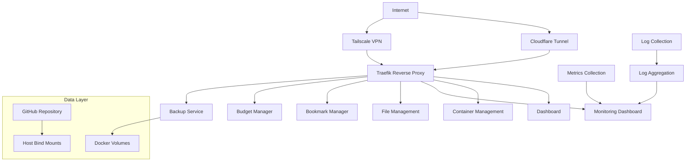

# Design Document

## Overview

The homelab infrastructure will be implemented as a containerized ecosystem using Docker Compose for orchestration, designed for easy deployment and recreation across different machines. The architecture follows a microservices approach where each service runs in its own container with proper networking, data persistence, and security configurations. The system uses Traefik as a reverse proxy for automatic HTTPS and service discovery, with a comprehensive monitoring stack (Prometheus, Grafana, Loki) for observability. All configurations are version-controlled through GitHub integration, enabling complete infrastructure-as-code deployment with automated backup and restoration capabilities.

## Architecture

### High-Level Architecture



### Network Architecture

- **Frontend Network**: Traefik-accessible services
- **Backend Network**: Internal service communication
- **Monitoring Network**: Observability stack isolation
- **Host Network**: Services requiring host access (Tailscale, system monitoring)

## Components and Interfaces

### Core Infrastructure

#### Traefik (Reverse Proxy & SSL)
- **Purpose**: Automatic HTTPS, service discovery, load balancing
- **Configuration**: File-based and Docker label discovery
- **SSL**: Let's Encrypt automatic certificate generation
- **Interfaces**: 
  - HTTP/HTTPS (ports 80/443)
  - Dashboard (port 8080)
  - Docker socket for service discovery

#### Docker Compose Orchestration
- **Purpose**: Service definition, networking, volume management
- **Structure**: Modular compose files for different service groups
- **Networks**: Isolated networks for security and organization
- **Volumes**: Named volumes for persistence, bind mounts for configuration
- **Deployment Strategy**: Single-command deployment with automatic directory creation
- **Error Handling**: Clear error messages and graceful service failure handling
- **Portability**: Environment-based configuration for cross-machine deployment

### Monitoring Stack

#### Prometheus (Metrics Collection)
- **Purpose**: Time-series metrics collection and alerting
- **Targets**: Node exporter, cAdvisor, application metrics
- **Storage**: Local time-series database with retention policies
- **Configuration**: Service discovery via file and Docker

#### Grafana (Visualization)
- **Purpose**: Metrics and logs visualization, alerting dashboard
- **Data Sources**: Prometheus (metrics), Loki (logs)
- **Dashboards**: Pre-configured for infrastructure monitoring
- **Authentication**: Local admin with persistent configuration

#### Loki + Promtail (Logging)
- **Loki**: Log aggregation and querying engine
- **Promtail**: Log collection agent for Docker containers
- **Storage**: Local filesystem with compression and retention
- **Integration**: Grafana data source for unified observability

### Application Services

#### Dashy (Dashboard)
- **Purpose**: Centralized service access and status monitoring
- **Configuration**: YAML-based service definitions
- **Features**: Service health checks, custom themes, search
- **Data**: Configuration persistence via volume mounts

#### Portainer (Container Management)
- **Purpose**: Docker container and stack management interface
- **Access**: Docker socket for container control
- **Features**: Container logs, resource monitoring, stack deployment
- **Security**: Role-based access control

#### FileBrowser (File Management)
- **Purpose**: Web-based file system access and sharing
- **Storage**: Bind mounts to host directories
- **Features**: File upload/download, sharing, user management
- **Security**: Authentication with configurable permissions

#### Productivity Applications
- **Linkding**: Bookmark management with tagging and search
- **Actual Budget**: Personal finance tracking and budgeting
- **Data**: SQLite databases with volume persistence

### Backup and Remote Access

#### Duplicati (Backup)
- **Purpose**: Automated backup with encryption and deduplication
- **Targets**: Local volumes, cloud storage providers
- **Scheduling**: Cron-based automatic backups
- **Features**: Incremental backups, restoration interface
- **Verification**: Automated backup integrity checking
- **Retention**: Configurable backup rotation policies

#### GitHub Integration
- **Purpose**: Version control for configuration files and infrastructure-as-code
- **Scope**: All configuration files, compose files, and deployment scripts
- **Workflow**: Git-based deployment with automated pulls on new machine setup
- **Backup Strategy**: Configuration files backed up to GitHub, data volumes backed up via Duplicati
- **Restoration**: Complete infrastructure recreation from GitHub repository

#### Remote Access
- **Tailscale**: Mesh VPN for secure remote access with device authentication
- **Cloudflare Tunnel**: Public access without port forwarding, with access policies
- **Configuration**: Environment-based authentication with secure credential management
- **Security**: Multi-layered access control with VPN and tunnel-based access

## Data Models

### Volume Management Strategy

```yaml
# Persistent Data Volumes
volumes:
  grafana_data:          # Grafana dashboards and settings
  prometheus_data:       # Metrics time-series data
  loki_data:            # Log storage
  portainer_data:       # Container management data
  duplicati_data:       # Backup configurations
  linkding_data:        # Bookmark database
  actual_data:          # Budget application data
  filebrowser_data:     # File browser database

# Configuration Bind Mounts
bind_mounts:
  ./config/traefik:/etc/traefik:ro
  ./config/prometheus:/etc/prometheus:ro
  ./config/grafana/provisioning:/etc/grafana/provisioning:ro
  ./config/loki:/etc/loki:ro
  ./config/promtail:/etc/promtail:ro
  ./data/files:/srv/files
  ./backups:/backups
```

### Configuration Structure

```
homelab-infrastructure/
├── docker-compose.yml           # Main orchestration
├── docker-compose.monitoring.yml # Monitoring stack
├── docker-compose.apps.yml      # Application services
├── .env                         # Environment variables
├── config/
│   ├── traefik/
│   │   ├── traefik.yml         # Static configuration
│   │   └── dynamic/            # Dynamic configuration
│   ├── prometheus/
│   │   └── prometheus.yml      # Metrics collection config
│   ├── grafana/
│   │   └── provisioning/       # Dashboards and datasources
│   ├── loki/
│   │   └── loki.yml           # Log aggregation config
│   └── promtail/
│       └── promtail.yml       # Log collection config
├── data/
│   ├── files/                 # FileBrowser storage
│   └── backups/              # Duplicati backup storage
└── scripts/
    ├── deploy.sh             # Deployment automation
    ├── backup.sh             # Manual backup trigger
    └── restore.sh            # Restoration utilities
```

## Error Handling

### Service Health Monitoring
- **Health Checks**: Docker health checks for all services
- **Restart Policies**: Automatic restart on failure with backoff
- **Dependency Management**: Service startup ordering with depends_on

### Backup and Recovery
- **Configuration Backup**: Git repository for configuration files
- **Data Backup**: Automated Duplicati backups with verification
- **Disaster Recovery**: Documentation for complete system restoration

### Logging and Alerting
- **Centralized Logging**: All container logs collected by Promtail
- **Error Aggregation**: Loki queries for error pattern detection
- **Alert Rules**: Prometheus alerting for critical service failures

### Network Resilience
- **SSL Certificate Renewal**: Automatic Let's Encrypt renewal
- **Service Discovery**: Traefik automatic backend detection
- **Fallback Access**: Multiple remote access methods (Tailscale, Cloudflare)

## Testing Strategy

### Infrastructure Testing
- **Container Health**: Automated health check validation
- **Service Connectivity**: Network connectivity testing between services
- **SSL Certificate Validation**: Automated certificate expiry monitoring
- **Backup Integrity**: Automated backup verification and test restores

### Integration Testing
- **Service Discovery**: Traefik routing validation for all services
- **Authentication Flow**: Access control testing for secured services
- **Data Persistence**: Volume mount and data retention validation
- **Monitoring Pipeline**: End-to-end observability stack testing

### Deployment Testing
- **Fresh Deployment**: Complete stack deployment on clean system
- **Configuration Validation**: Environment variable and config file validation
- **Service Startup Order**: Dependency resolution and startup sequence testing
- **Resource Allocation**: Container resource limits and performance testing

### Operational Testing
- **Backup and Restore**: Full backup/restore cycle validation
- **Service Recovery**: Failure simulation and recovery testing
- **Performance Monitoring**: Resource usage and performance baseline establishment
- **Security Validation**: Access control and network security testing