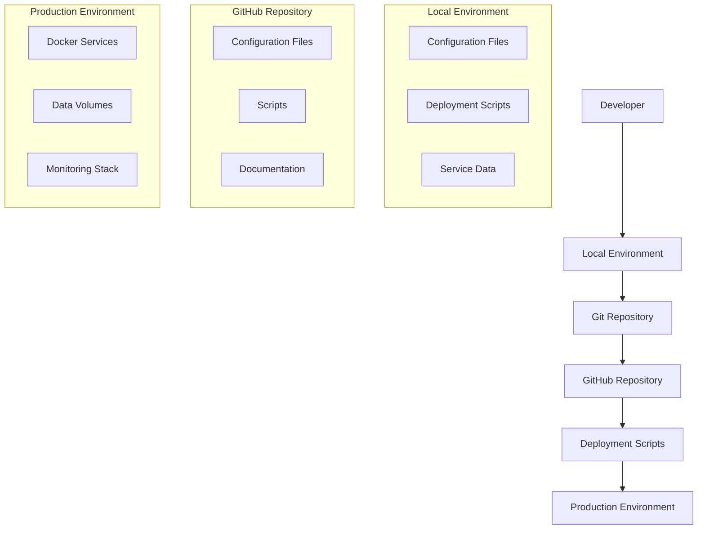
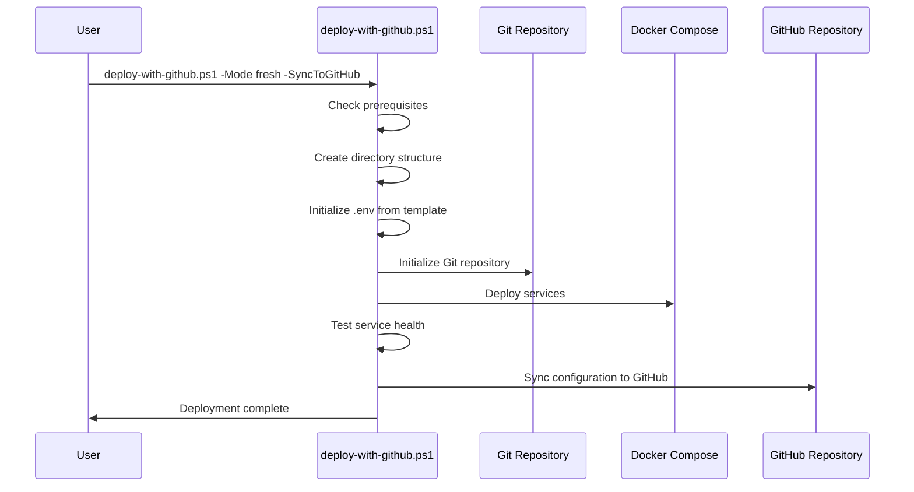
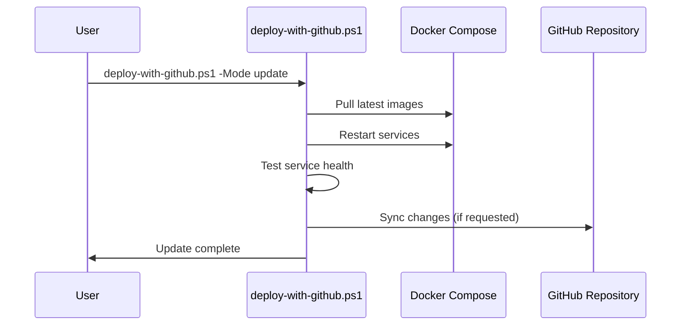
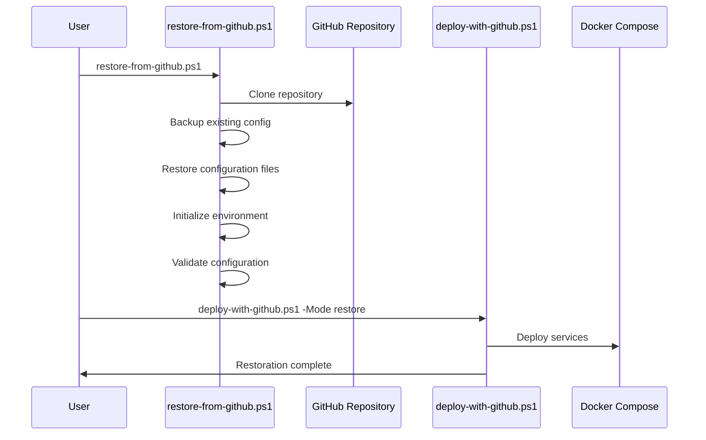

# GitHub Integration Documentation

This document describes the comprehensive GitHub integration features of the homelab infrastructure, including configuration management, automated deployment, and disaster recovery capabilities.

## Overview

The GitHub integration provides:

- **Configuration Version Control**: All configuration files are tracked in Git
- **Automated Deployment**: Scripts for deploying from GitHub repository
- **Disaster Recovery**: Complete infrastructure restoration from repository
- **Change Management**: Track and manage configuration changes over time
- **Multi-Environment Support**: Deploy to different environments from the same repository

## Architecture



## Configuration Management

### Files Included in Version Control

The following files and directories are automatically managed in Git:

- `docker-compose.yml` - Main orchestration file
- `docker-compose.*.yml` - Additional compose files
- `.env.template` - Environment template (without secrets)
- `.gitignore` - Git ignore rules
- `README.md` - Documentation
- `config/` - All service configurations
- `scripts/` - Deployment and management scripts
- `docs/` - Documentation files
- `.kiro/` - Kiro specifications and tasks

### Files Excluded from Version Control

Sensitive and environment-specific files are excluded:

- `.env` - Contains secrets and environment-specific values
- `data/` - Service data volumes
- `*.log` - Log files
- `config/cloudflared/credentials.json` - Tunnel credentials
- `config/*/secrets/` - Service-specific secrets
- Files matching patterns: `*password*`, `*secret*`, `*key*`, `*token*`

## Scripts and Tools

### 1. github-sync.ps1

Comprehensive GitHub synchronization script.

**Usage:**
```powershell
# Initialize Git repository
.\scripts\github-sync.ps1 -Action init

# Check repository status
.\scripts\github-sync.ps1 -Action status

# Push changes to GitHub
.\scripts\github-sync.ps1 -Action push -Message "Updated monitoring config"

# Pull changes from GitHub
.\scripts\github-sync.ps1 -Action pull
```

**Features:**
- Automatic Git repository initialization
- Intelligent file filtering (include/exclude patterns)
- Conflict resolution for pull operations
- Comprehensive error handling and logging
- Authentication via GitHub personal access token

### 2. git-ops.ps1

Simplified wrapper for common Git operations.

**Usage:**
```powershell
# Save configuration to GitHub
.\scripts\git-ops.ps1 save "Configuration update"

# Load latest from GitHub
.\scripts\git-ops.ps1 load

# Check status
.\scripts\git-ops.ps1 status

# Setup repository
.\scripts\git-ops.ps1 setup
```

### 3. deploy-with-github.ps1

Complete deployment script with GitHub integration.

**Usage:**
```powershell
# Fresh deployment with GitHub sync
.\scripts\deploy-with-github.ps1 -Mode fresh -SyncToGitHub

# Update existing deployment
.\scripts\deploy-with-github.ps1 -Mode update

# Restore from GitHub
.\scripts\deploy-with-github.ps1 -Mode restore -Branch main
```

**Deployment Modes:**
- **Fresh**: Complete new installation
- **Update**: Update existing installation with latest images
- **Restore**: Restore configuration from GitHub repository

### 4. restore-from-github.ps1

Automated configuration restoration from GitHub.

**Usage:**
```powershell
# Restore from configured repository
.\scripts\restore-from-github.ps1

# Restore from specific repository
.\scripts\restore-from-github.ps1 -RepositoryUrl "https://github.com/user/repo.git"

# Force restore (overwrite existing files)
.\scripts\restore-from-github.ps1 -Force

# Restore from specific branch
.\scripts\restore-from-github.ps1 -Branch develop
```

## Environment Configuration

### GitHub Variables in .env

Configure these variables in your `.env` file:

```bash
# GitHub Integration
GITHUB_USERNAME=your-github-username
GITHUB_TOKEN=your-github-personal-access-token
GITHUB_REPO=your-username/homelab-infrastructure
GITHUB_REPO_URL=https://github.com/your-username/homelab-infrastructure.git
```

### GitHub Personal Access Token

Create a GitHub Personal Access Token with the following permissions:

1. Go to GitHub Settings → Developer settings → Personal access tokens
2. Generate new token (classic)
3. Select scopes:
   - `repo` (Full control of private repositories)
   - `workflow` (Update GitHub Action workflows)
4. Copy the token to your `.env` file as `GITHUB_TOKEN`

## Deployment Workflows

### 1. Fresh Installation Workflow



### 2. Update Workflow



### 3. Restore Workflow



## Best Practices

### 1. Configuration Management

- **Commit Frequently**: Save configuration changes to GitHub regularly
- **Meaningful Messages**: Use descriptive commit messages
- **Test Before Commit**: Validate configuration before pushing to GitHub
- **Branch Strategy**: Use branches for experimental changes

### 2. Security

- **Never Commit Secrets**: Ensure `.env` file is in `.gitignore`
- **Token Security**: Protect your GitHub personal access token
- **Regular Rotation**: Rotate tokens and passwords regularly
- **Access Control**: Use repository access controls appropriately

### 3. Deployment

- **Backup First**: Always backup before major changes
- **Test Locally**: Test changes in local environment first
- **Gradual Rollout**: Deploy changes incrementally
- **Monitor Health**: Check service health after deployment

### 4. Disaster Recovery

- **Regular Backups**: Ensure both configuration and data are backed up
- **Test Restoration**: Regularly test the restoration process
- **Documentation**: Keep restoration procedures documented
- **Multiple Copies**: Store backups in multiple locations

## Troubleshooting

### Common Issues

#### 1. Authentication Failures

**Problem**: Git operations fail with authentication errors

**Solutions:**
- Verify `GITHUB_TOKEN` is correct and has proper permissions
- Check if token has expired
- Ensure `GITHUB_USERNAME` matches the token owner

#### 2. Repository Not Found

**Problem**: Cannot clone or access repository

**Solutions:**
- Verify `GITHUB_REPO` and `GITHUB_REPO_URL` are correct
- Check repository exists and is accessible
- Verify token has access to the repository

#### 3. Merge Conflicts

**Problem**: Pull operations fail due to conflicts

**Solutions:**
- Use `git status` to identify conflicted files
- Manually resolve conflicts
- Use `git stash` to temporarily save local changes
- Consider using `restore-from-github.ps1 -Force` for complete restoration

#### 4. Deployment Failures

**Problem**: Services fail to start after restoration

**Solutions:**
- Check `.env` file is properly configured
- Verify Docker and Docker Compose are running
- Check service logs: `docker-compose logs <service-name>`
- Validate configuration: `docker-compose config`

### Diagnostic Commands

```powershell
# Check Git status
.\scripts\git-ops.ps1 status

# Validate Docker Compose configuration
docker-compose config

# Check service health
docker-compose ps

# View service logs
docker-compose logs <service-name>

# Test GitHub connectivity
git ls-remote origin
```

## Advanced Usage

### Custom Branches

```powershell
# Deploy from specific branch
.\scripts\deploy-with-github.ps1 -Mode restore -Branch feature/new-monitoring

# Restore from development branch
.\scripts\restore-from-github.ps1 -Branch develop
```

### Multiple Environments

```powershell
# Production deployment
.\scripts\deploy-with-github.ps1 -Mode fresh -SyncToGitHub

# Staging deployment (different .env)
cp .env.staging .env
.\scripts\deploy-with-github.ps1 -Mode fresh
```

### Automated Workflows

Create scheduled tasks or cron jobs for automated operations:

```powershell
# Daily configuration backup
.\scripts\git-ops.ps1 save "Daily automated backup"

# Weekly update deployment
.\scripts\deploy-with-github.ps1 -Mode update -SyncToGitHub
```

## Integration with Other Tools

### CI/CD Pipelines

The scripts can be integrated with CI/CD pipelines:

```yaml
# Example GitHub Actions workflow
name: Deploy Homelab
on:
  push:
    branches: [main]
jobs:
  deploy:
    runs-on: self-hosted
    steps:
      - uses: actions/checkout@v2
      - name: Deploy
        run: .\scripts\deploy-with-github.ps1 -Mode update
```

### Monitoring Integration

Monitor GitHub operations through:

- Grafana dashboards for deployment metrics
- Prometheus alerts for failed deployments
- Log aggregation in Loki for deployment logs

### Backup Integration

Coordinate with Duplicati for complete backup strategy:

- Configuration files → GitHub
- Service data → Duplicati
- Combined restoration process

## Support and Maintenance

### Regular Maintenance Tasks

1. **Weekly**: Review and commit configuration changes
2. **Monthly**: Test restoration process
3. **Quarterly**: Rotate GitHub tokens and passwords
4. **Annually**: Review and update documentation

### Monitoring GitHub Integration

- Monitor repository size and growth
- Track deployment success/failure rates
- Review access logs and security events
- Monitor token usage and expiration

### Updates and Improvements

The GitHub integration scripts are designed to be:

- **Extensible**: Easy to add new features
- **Maintainable**: Clear code structure and documentation
- **Reliable**: Comprehensive error handling and logging
- **Secure**: Following security best practices

For issues, improvements, or questions, refer to the project repository or create an issue in GitHub.